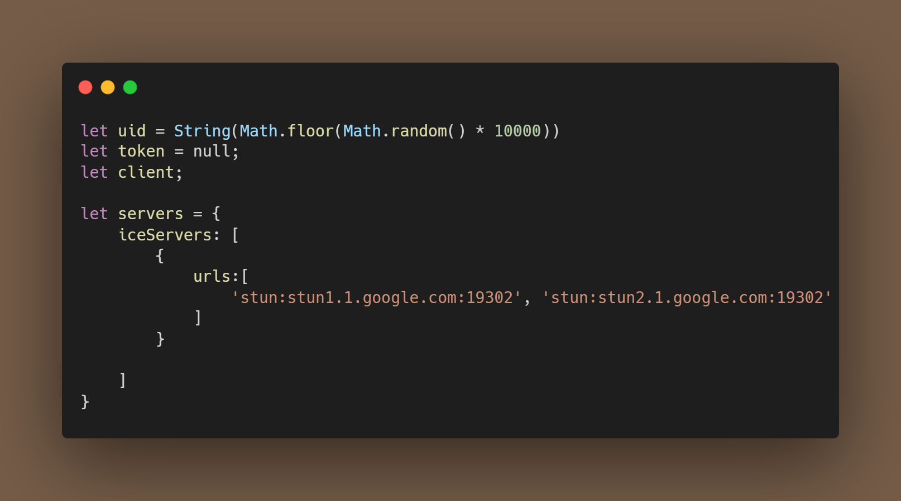

# A website with WebRTC
I have been making a WebRTC website. On the WebRTC website the user estabishes a peer to peer connection between two browsers to exchange video data in real time. To try it out open the <a href="https://sofiahjerpe.github.io/WebRTC/">url</a> in two different tabs. The peers will automaticly create an sdp offer, a sdp answer and ICE candidates. When the peers creates an sdp offer and an sdp answer and ICE candidates the video can show up on the other tab. When the video shows up on the other tab a real time connection is established.

## Installation
1.  To clone the repo click at the code button and copy the link. 
2.  Open the terminal by clicking on git bash. Git bash where you want to clone the code. In git bash terminal write the following git clone "paste link"
 
## Usage
To use WebRTC open the link in two different tabs so that the peers can send sdp offer and sdp answer to eachother. 

## Additional info 

In the code example above the Math.random() method is introduced to generate a floating point number between 0 and 10000. The Math.floor() method returns the largest intreger less than or equal to a given number. In the code example above I am also getting the Iceservers urls where the ICEcandidates come from.  In this case I use a server from Google. 

## Licence 
This code includes a MIT Licence. 

